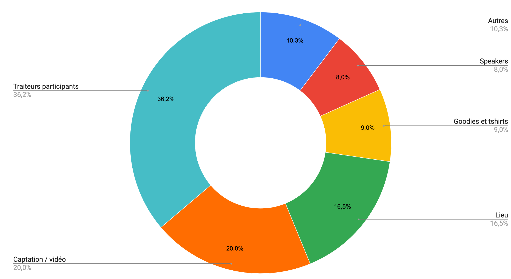
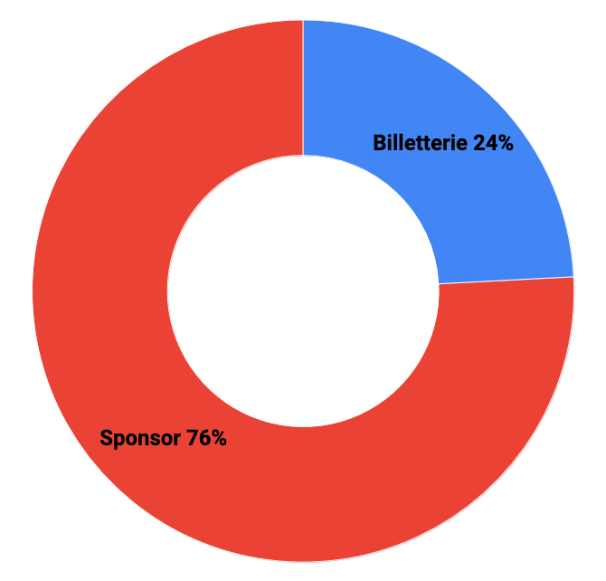

Depuis 2019, SunnyTech s’efforce de garder des prix fixes pour rendre la conférence plus accessible. Cela s’est traduit par un gel des tarifs, avec une baisse des tarifs participants en 2024 en passant les t-shirts en option payante (entre autres pour réduire l’empreinte écologique de l’événement).

Afin de pérenniser l’événement pour les prochaines années avec la même qualité, mais surtout pour 2025, SunnyTech a décidé de revoir les tarifs des places (et des offres de sponsoring) :

-   Nouveau tarif unique : 100 €
-   Fin des early birds : pour rendre les tarifs équitables, quelle que soit la date où vous prenez votre place.
-   Le tarif étudiant reste inchangé : 40 €
-   ❗Deux périodes de vente uniquement en 2025 (fin janvier et début avril)❗

Pour ceux qui le souhaitent, le ticket participant a désormais un prix plancher (ou prix minimum) à 100 €, mais si vous souhaitez mettre plus pour soutenir la conférence et l'association, c’est avec grand plaisir 🙂

24 % des revenus de la conférence viennent de la billetterie et 76 % des sponsors.

Nous rappelons que tous les membres de l’équipe participant à l’organisation de la conférence le font sur leur temps personnel et sont tous bénévoles. Dans le cas d’un déficit sur une année, c’est à l’association de payer le différend, et si l'argent disponible sur le fonds de roulement de l'asso n’est pas suffisant, celle-ci devra fermer et le président devra rembourser la dette avec ses propres finances.

Un peu plus de détails sur le budget de SunnyTech :

Répartition des dépenses :

Répartition des recettes :

